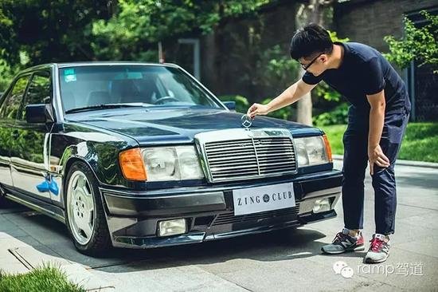
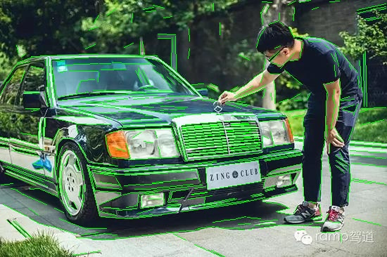
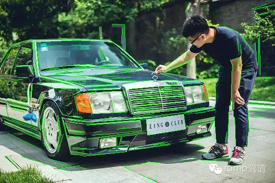
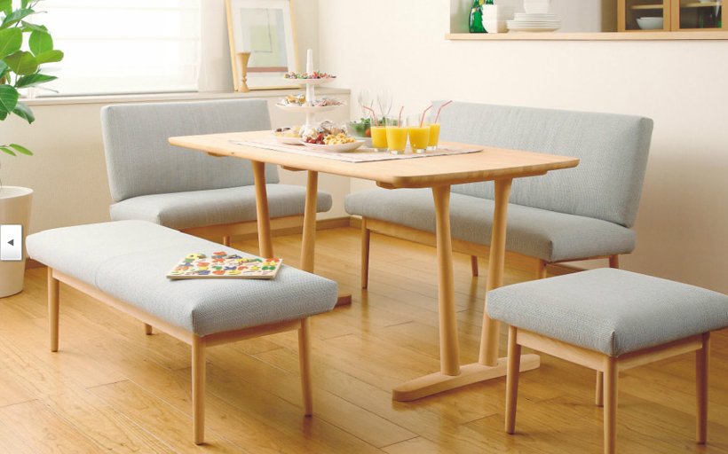
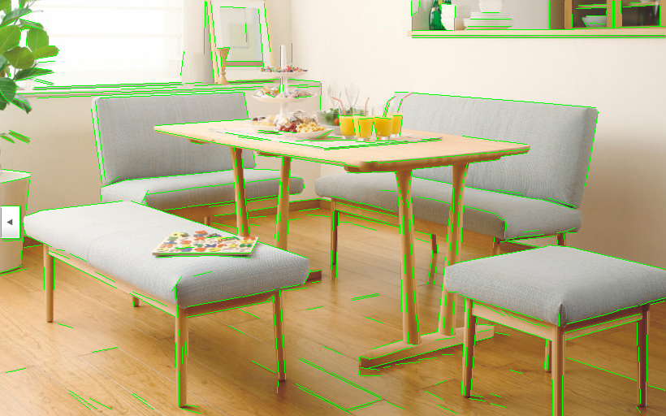
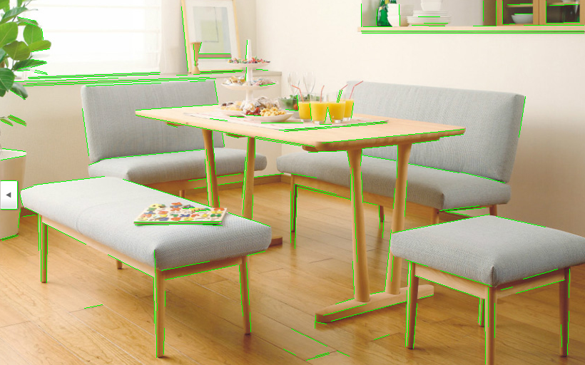
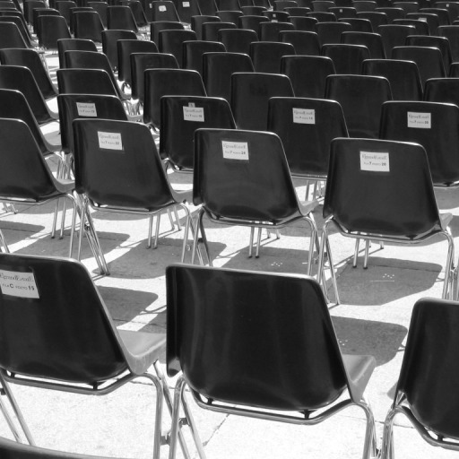
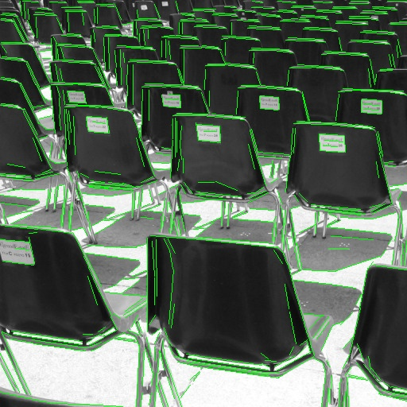
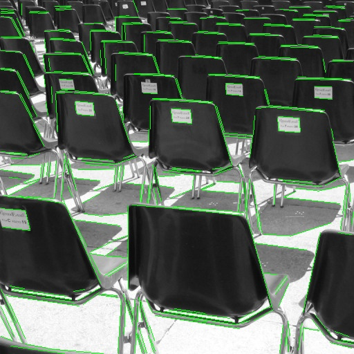

pylsd2
=============

### 1. Introduction

pylsd2 is the python bindings for Line Segment Detection algorithm, including [LSD](http://www.ipol.im/pub/art/2012/gjmr-lsd/) and [EDLines](https://www.sciencedirect.com/science/article/abs/pii/S0167865511001772).  
* LSD part is forked from [pylsd](https://github.com/primetang/pylsd), and upgrade lsd from 1.5 to 1.6, thanks primetang
* EDLines part is forked from [line_detector](https://github.com/frotms/line_detector), thanks frotms

Windows and linux is supported currently, merge request for mac is welcome

### 2. Install

directly through `pip` to install it:
```
[sudo] pip install pylsd2
```

### 3. Usage

* by using cv2 module  
```python
import cv2
from pylsd2 import LineSegmentDetection, LineSegmentDetectionED
fullName, out_path = 'car.jpg', 'car_lsd.jpg'
src = cv2.imread(fullName, cv2.IMREAD_COLOR)
gray = cv2.cvtColor(src, cv2.COLOR_BGR2GRAY)
# input single channel image
lines = LineSegmentDetection(gray)  # [(x1, y1, x2, y2, width, p, log_nfa), ...]
# lines = LineSegmentDetectionED(gray)  # [(x1, y1, x2, y2), ...]
for l in lines:
    pt1, pt2 = tuple(l[:2]), tuple(l[2:4])
    cv2.line(src, pt1, pt2, (0, 0, 255), 1)
cv2.imwrite(out_path, src)
```

* by using PIL(Image) module  
```python
from PIL import Image, ImageDraw
import numpy as np
from pylsd2 import LineSegmentDetection, LineSegmentDetectionED
fullName, out_path = 'car.jpg', 'car_edlines.jpg'
img = Image.open(fullName)
gray = np.asarray(img.convert('L'))
# input single channel image
lines = LineSegmentDetection(gray)
# lines = LineSegmentDetectionED(gray)
draw = ImageDraw.Draw(img)
for l in lines:
    pt1, pt2 = l[:2], l[2:4]
    draw.line((pt1, pt2), fill=(0, 0, 255), width=1)
img.save(out_path)
```

[more examples](https://github.com/anyongjin/pylsd2/tree/master/example):


The following is the result:

* car.jpg Original  


* with lsd algorithm  


* with EDLines algorithm  



* house.png Original  


* with lsd algorithm  


* with EDLines algorithm  

  

* chairs.jpg Original  


* with lsd algorithm  


* with EDLines algorithm  


### 4. Compile Library from cpp
** Windows **  
```shell
cd source && mkdir build && cd build
cmake ..
```
open the LSD.sln with Visual Studio, and Build The "ALL_BUILD" Project  
** Linux **  
```shell
cd source && mkdir build_so && cd build_so
cmake ..
cmake --build .
```

